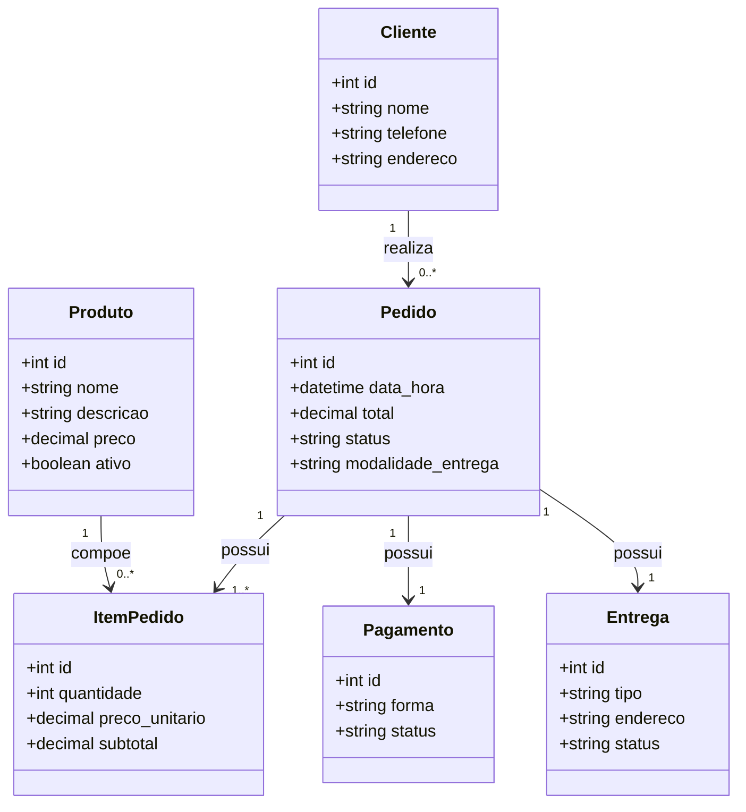
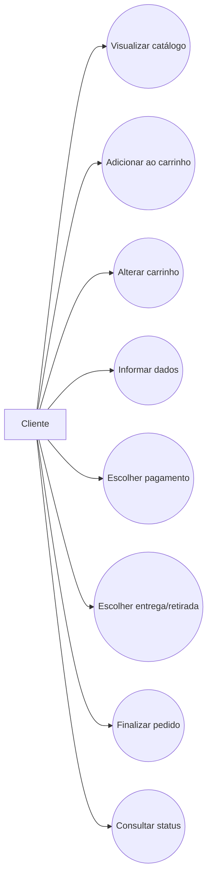
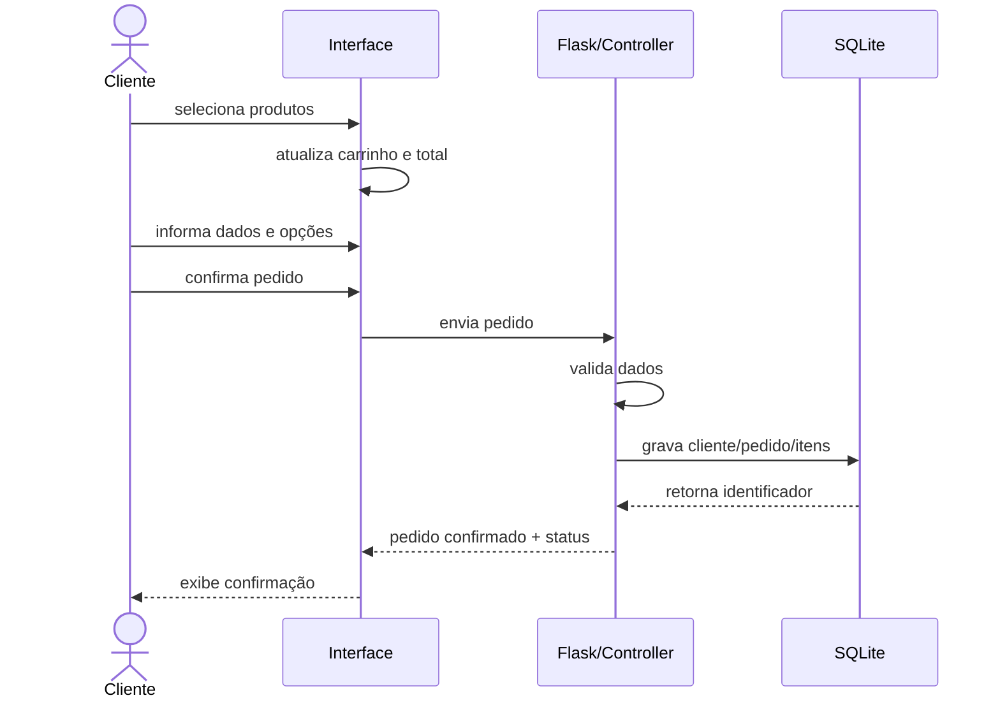
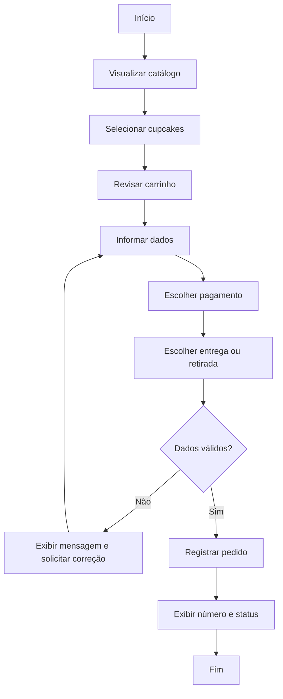
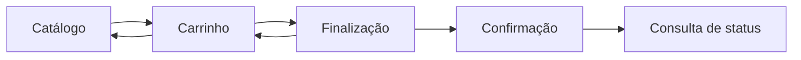

# 03 — Modelagem UML e Interface Humano-Computador

## 1. Diagrama de classes

## 2. Casos de uso principais

## 3. Diagrama de sequência — finalização do pedido

## 4. Diagrama de atividade

## 5. Diretrizes de IHC adotadas

A interface será construída com foco em simplicidade, clareza e previsibilidade. Os elementos principais deverão manter o mesmo padrão visual e de interação em todas as etapas.

### Estrutura das telas

**Tela inicial / catálogo**
- Identificação da loja;
- Cards dos cupcakes;
- Nome, descrição e preço;
- Botão visível para adicionar ao carrinho;
- Indicador de quantidade de itens no carrinho.

**Carrinho**
- Lista dos produtos selecionados;
- Quantidade de cada item;
- Ações de aumentar, diminuir e remover;
- Subtotal por item;
- Total geral destacado;
- Botão para avançar.

**Finalização**
- Nome e telefone;
- Modalidade de recebimento;
- Campo de endereço exibido quando a opção for entrega;
- Forma de pagamento;
- Resumo do pedido;
- Botão de confirmação.

**Confirmação**
- Mensagem clara de sucesso;
- Número do pedido;
- Valor total;
- Status inicial;
- Orientação para consulta do pedido.

**Consulta de status**
- Campo para número do pedido;
- Botão de consulta;
- Retorno do status ou mensagem de pedido não encontrado.

## 6. Tratamento de erros e feedback

- Campos obrigatórios terão indicação visível;
- Carrinho vazio impedirá a finalização;
- Endereço será exigido somente quando houver entrega;
- Mensagens de erro deverão informar o problema e a correção necessária;
- Após uma ação válida, o sistema fornecerá feedback imediato;
- A confirmação do pedido destacará o identificador gerado.

## 7. Fluxo de navegação

A navegação mantém o fluxo curto, permitindo retorno ao catálogo e ao carrinho antes da confirmação final.
